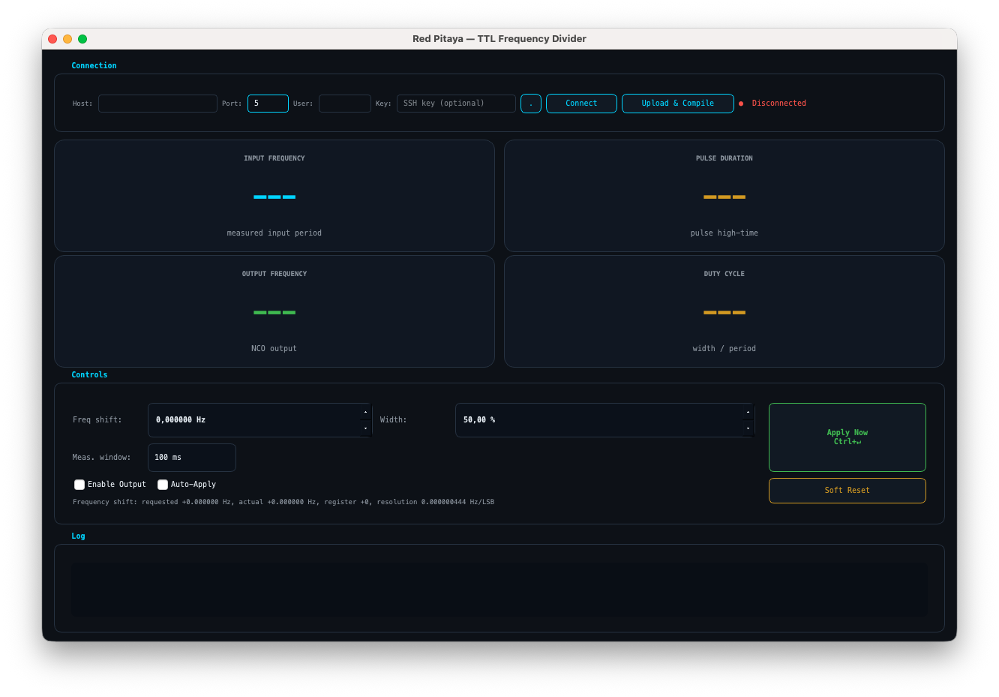

# Red Pitaya TTL Shifter

Desktop tools for controlling a custom Red Pitaya FPGA TTL pulse/NCO shifter over SSH.

The main application is `redpitaya_pulse_gui_qt.py`, a PySide6 GUI that connects to a Red Pitaya, uploads and compiles the board-side register helper, optionally loads the FPGA bitstream, and provides live control of output enable, pulse width, and signed frequency shift. A terminal register monitor is also included for debugging.



```text
External TTL signal -> DIO0_P -> FPGA pulse/NCO shifter -> DIO1_P -> shifted TTL output
                                      ^
                                      |
                         SSH/SFTP from the desktop GUI
```

## Project Contents

| Path | Purpose |
|------|---------|
| `redpitaya_pulse_gui_qt.py` | Main PySide6 desktop control GUI. |
| `redpitaya_register_monitor.py` | Command-line live register monitor over OpenSSH. |
| `rp_pulse_ctl.c` | Board-side C helper that reads/writes FPGA registers through `/dev/mem`. |
| `red_pitaya_top.bit.bin` | FPGA bitstream loaded by the GUI when present. |
| `last/red_pitaya_top.bit.bin` | Previous/archived FPGA bitstream copy. |
| `GUI.png` | README screenshot. |
| `requirements.txt` | Python packages needed by the Qt GUI. |

## Functionality

The Qt GUI provides:

- Persistent SSH/SFTP connection using `paramiko`, with all board I/O kept off the UI thread.
- Host, port, user, and optional private-key based connection settings.
- One-click upload of `rp_pulse_ctl.c` to `/root/rp_pulse_ctl.c`.
- Remote compile of `/root/rp_pulse_ctl` with `gcc`.
- Optional upload and load of `red_pitaya_top.bit.bin` with `/opt/redpitaya/bin/fpgautil`.
- Live polling of FPGA register state.
- Input frequency readout from the measured FPGA period register.
- Output frequency readout from the live 48-bit NCO phase step.
- Pulse width control as a fraction of the measured input period.
- Signed frequency-shift control in Hz, converted to a signed 48-bit phase-step offset.
- Output enable, auto-apply, manual apply, and soft reset controls.
- Status and operation log inside the GUI.

The command-line monitor provides:

- Repeated register readback through the board-side helper.
- Decoded control/status flags.
- Raw and averaged input periods with derived input frequency.
- Pulse width and additional helper payload fields for debugging register-level behavior.

## Hardware Assumptions

- Board: Red Pitaya STEMlab 125-14 or compatible 125 MHz Red Pitaya target.
- FPGA clock: 125 MHz.
- Input: `DIO0_P` / `GND`.
- Output: `DIO1_P` / `GND`.
- Red Pitaya SSH access, normally as `root`.
- `gcc` available on the Red Pitaya.
- `/opt/redpitaya/bin/fpgautil` available when loading the bitstream from the GUI.

## Register Map

The GUI and monitor communicate with the FPGA through `/root/rp_pulse_ctl`. The default AXI base address is `0x40600000`.

| Offset | Register | Description |
|--------|----------|-------------|
| `0x00` | `control` | Bit 0 = output enable, bit 1 = soft reset strobe. |
| `0x08` | `width` | Pulse width in 125 MHz clock cycles. |
| `0x10` | `status` | Bit 0 = busy, bit 1 = period valid, bit 2 = timeout, bit 3 = period stable, bit 4 = freerun active. |
| `0x14` | `raw_period` | Last measured input period in clock cycles. |
| `0x18` | `period_avg` | Filtered/averaged measured input period in clock cycles. |
| `0x1C` | `phase_step_offset_lo` | Low 32 bits of signed 48-bit NCO frequency offset. |
| `0x20` | `phase_step_offset_hi` | High 16 bits of signed 48-bit NCO frequency offset. |
| `0x24` | `phase_step_base_lo` | Low 32 bits of computed base phase step, read-only. |
| `0x28` | `phase_step_base_hi` | High 16 bits of computed base phase step, read-only. |
| `0x2C` | `phase_step_lo` | Low 32 bits of live phase step, read-only. |
| `0x30` | `phase_step_hi` | High 16 bits of live phase step, read-only. |

Useful conversions:

```text
input_frequency_hz = 125_000_000 / period_avg
frequency_offset_hz = phase_step_offset * 125_000_000 / 2^48
phase_step_offset = round(frequency_offset_hz * 2^48 / 125_000_000)
pulse_width_cycles = round(width_fraction * period_avg)
```

## Installation

Create a virtual environment and install the GUI dependencies:

```bash
python3 -m venv .venv
.venv/bin/python -m pip install --upgrade pip
.venv/bin/python -m pip install -r requirements.txt
```

`redpitaya_register_monitor.py` uses only the Python standard library, but it shells out to the system `ssh` command.

## Running the GUI

```bash
.venv/bin/python redpitaya_pulse_gui_qt.py
```

1. Enter the Red Pitaya hostname or IP, for example `rp-xxxxxx.local`.
2. Keep the default SSH port `22` and user `root` unless your board differs.
3. Choose an SSH private key if passwordless key auth is required.
4. Click **Connect**.
5. Click **Upload && Compile** after connecting if `/root/rp_pulse_ctl` is missing or stale.

When `red_pitaya_top.bit.bin` exists next to the GUI script, **Upload && Compile** also uploads it to `/root/red_pitaya_top.bit.bin` and loads it with `fpgautil`.

## GUI Controls

| Control | Effect |
|---------|--------|
| **Width** | Sets pulse high time as a fraction of the measured input period. |
| **Freq shift** | Sets signed output frequency offset in Hz. The GUI shows requested Hz, quantized actual Hz, register word, and target output frequency when an input period is available. |
| **Enable Output** | Writes control bit 0. |
| **Auto-Apply** | Sends changed values after a 300 ms debounce. |
| **Apply Now** | Writes current width, frequency shift, and enable state immediately. Shortcut: `Ctrl+Return`. |
| **Soft Reset** | Pulses the FPGA soft-reset bit. |
| **Upload && Compile** | Uploads and compiles the C helper, and loads the bitstream if present. |

The display cards show measured input frequency, live output frequency, pulse duration, and duty cycle. Polling runs faster while the FPGA reports an unstable or missing period.

## Running the Register Monitor

The monitor expects `/root/rp_pulse_ctl` to already exist on the board.

```bash
python3 redpitaya_register_monitor.py --host rp-xxxxxx.local
```

Optional arguments:

```bash
python3 redpitaya_register_monitor.py \
  --host rp-xxxxxx.local \
  --user root \
  --port 22 \
  --base-addr 0x40600000 \
  --interval 0.5 \
  --count 20
```

## Board-Side Helper

The GUI normally handles helper installation. To compile it manually on the board:

```bash
scp rp_pulse_ctl.c root@rp-xxxxxx.local:/root/rp_pulse_ctl.c
ssh root@rp-xxxxxx.local 'gcc -O2 -o /root/rp_pulse_ctl /root/rp_pulse_ctl.c'
```

Manual readback:

```bash
ssh root@rp-xxxxxx.local '/root/rp_pulse_ctl 0x40600000 read'
```

Manual write:

```bash
ssh root@rp-xxxxxx.local '/root/rp_pulse_ctl 0x40600000 write <width_cycles> <phase_step_offset> <control>'
```

## Troubleshooting

- If the GUI exits with a PySide6 error, reinstall dependencies with `python -m pip install -r requirements.txt`.
- If Connect fails, verify hostname/IP, SSH credentials, and that the board accepts SSH from your computer.
- If register reads fail, upload and compile `rp_pulse_ctl.c` again.
- If the FPGA image does not load, confirm `/opt/redpitaya/bin/fpgautil` exists on the board and that `red_pitaya_top.bit.bin` is the correct bitstream for your Red Pitaya OS/image.
- If input frequency shows `---`, verify the TTL input is present on `DIO0_P` and shares ground with the Red Pitaya.

## License

MIT. See [LICENSE](LICENSE).
